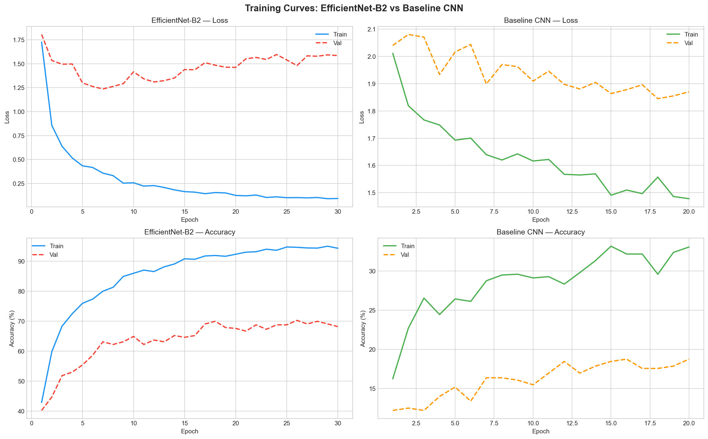
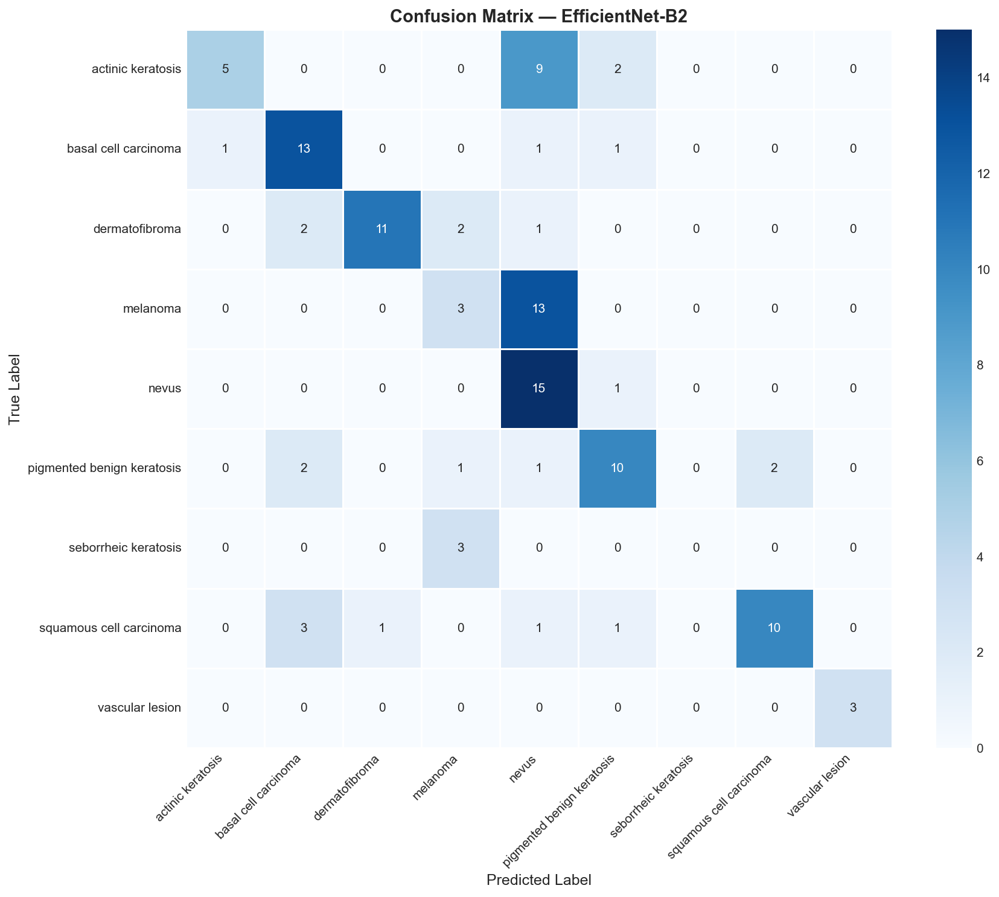
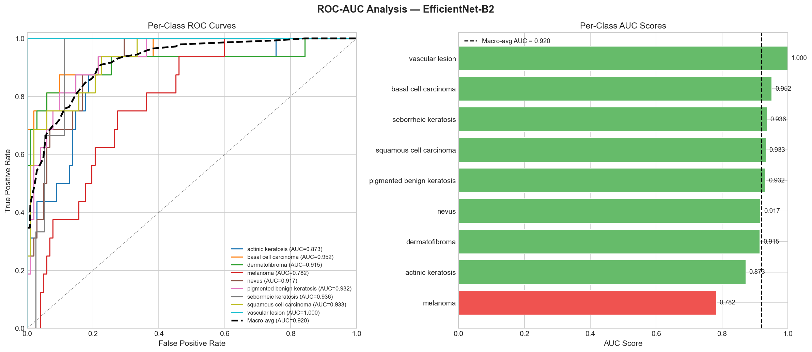
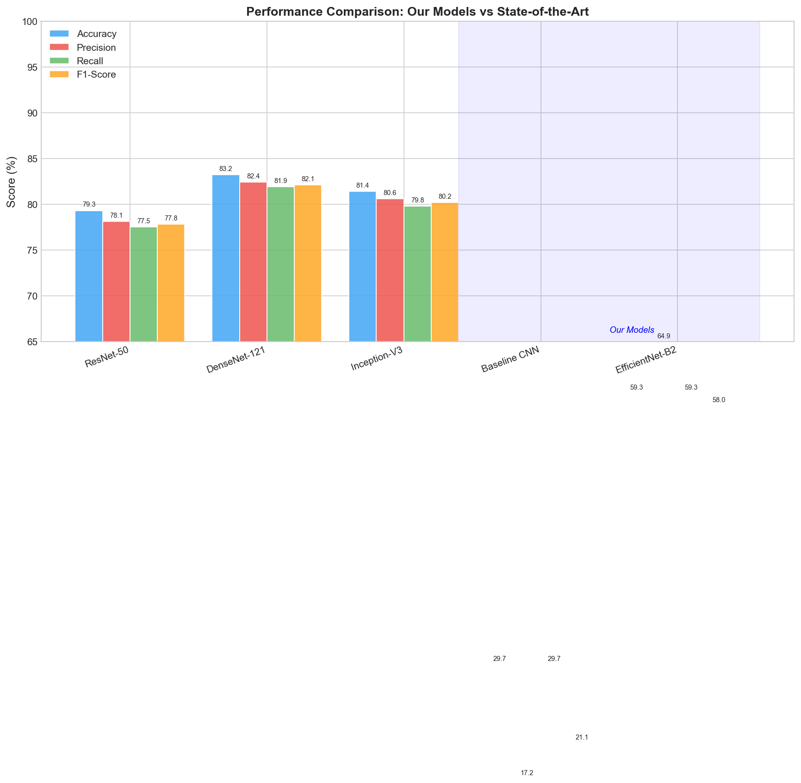

# Skin Cancer Detection through Deep Learning using Skin Lesion Images

> 9-class skin lesion classification using EfficientNet-B2, transfer learning, and Grad-CAM explainability on the ISIC dataset.

---

## Overview

Skin cancer is among the most prevalent malignancies globally, with melanoma alone projected to reach 510,000 new cases by 2040. Manual diagnosis is subjective, specialist-dependent, and prone to delays due to the global shortage of dermatologists.

This project develops an **automated deep learning pipeline** for classifying dermoscopic skin lesion images into **9 disease categories** using **EfficientNet-B2** with transfer learning, while addressing class imbalance and providing clinically interpretable predictions via **Grad-CAM**.

---

## Dataset

**Source:** [ISIC Archive](https://isic-archive.com) — International Skin Imaging Collaboration

| Class | Train | Test |
|---|---|---|
| Actinic Keratosis | 114 | 16 |
| Basal Cell Carcinoma | 376 | 16 |
| Dermatofibroma | 95 | 16 |
| Melanoma | 438 | 16 |
| Nevus | 357 | 16 |
| Pigmented Benign Keratosis | 462 | 16 |
| Seborrheic Keratosis | 77 | 3 |
| Squamous Cell Carcinoma | 181 | 16 |
| Vascular Lesion | 139 | 3 |

- **Total images:** 2,357 | **Train:** 2,239 | **Test:** 118 | **Train/Val split:** 85/15


---

## Architecture

Two models were developed and compared:

### Baseline CNN
A custom CNN built from scratch with convolutional, ReLU, MaxPooling, Dropout, and fully connected layers — used as a performance reference.

### EfficientNet-B2 (Primary Model)
- Pretrained on ImageNet (transfer learning)
- Uses compound scaling to balance depth, width, and resolution
- Built with MBConv blocks and Squeeze-and-Excitation (SE) attention
- Final classification layer modified for 9-class output



---

## Methodology

- **Preprocessing:** Resize, normalize, and augment dermoscopic images
- **Class Imbalance:** Handled via `WeightedRandomSampler` + class-weighted `CrossEntropyLoss`
- **Optimizer:** AdamW with weight decay to reduce overfitting
- **Explainability:** Grad-CAM heatmaps on the final convolutional layer

---

## Results

### Training Curves


### Confusion Matrix



### ROC-AUC Curve



### Model Comparison



---

## Grad-CAM Explainability

Grad-CAM generates heatmaps highlighting image regions the model focuses on during classification — red/yellow regions indicate high attention, helping interpret model decisions in a clinically meaningful way.


---

## Tech Stack

- Python, PyTorch
- EfficientNet-B2 (torchvision)
- scikit-learn (metrics)
- Grad-CAM
- Matplotlib, Seaborn

---

## Project Structure

```
skin-cancer-detection-dl/
├── notebooks/
│   └── DL_SkinCancerProject.ipynb   # Main notebook
├── plots/                           # All output plots and figures
│   ├── confusion_matrix_*.png
│   ├── roc_auc_*.png
│   ├── training_curves_*.png
│   ├── gradcam_result.png
│   ├── class_distribution.png
│   ├── sample_images.png
│   └── comparison_bar.png
├── docs/                            # Report and research paper
├── .gitignore
└── README.md
```


---

## Reference Paper

S. Islam et al., *"Advancing Skin Cancer Detection Through Deep Learning and Fusion of Patient Metadata and Skin Lesion Images"*, Scientific Reports, vol. 16, no. 1968, 2026. [DOI: 10.1038/s41598-025-26392-4](https://doi.org/10.1038/s41598-025-26392-4)

---

## Author

**Ambarapu Aswan Shareen**
*Amrita School of Engineering, Bengaluru*
